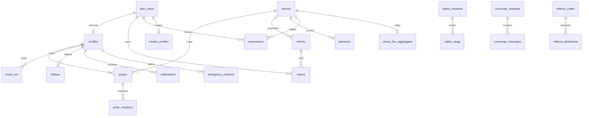

# Database Schema

Reference for the Supabase PostgreSQL schema defined in `supabase/migrations/`. Apply migrations with [Backend Migration](backend-migration.md).

**Extensions:** PostGIS (`venues.geom`)

**Auth:** `profiles` extends `auth.users`. Most tables FK to `profiles(id)` or `auth.users(id)`.

---

## Migration inventory

| File | Domain |
|------|--------|
| `20260322000000_initial_schema.sql` | profiles, venues, pulses, notifications |
| `20260329000001_add_missing_tables_and_columns.sql` | presence, events, extra columns |
| `20260329000002_rls_policies.sql` | Initial RLS |
| `20260329000003_realtime.sql` | Realtime publication |
| `20260417000001_core_tables_and_soft_delete.sql` | reactions, check_ins, follows, soft-delete |
| `20260417000002_rls_policies_enforcement.sql` | Full RLS policy set |
| `20260417000003_ticketing_and_reservations.sql` | events, tickets, reservations, venue_staff |
| `20260417000004_safety_kit.sql` | emergency contacts, safety sessions |
| `20260417000005_ai_concierge.sql` | concierge sessions, messages, plans |
| `20260417000006_venue_structured_metadata.sql` | dress code, cover charge, accessibility |
| `20260417000007_ticket_scans.sql` | door scan fields, venue_staff roles |
| `20260417000008_push_tokens.sql` | device push tokens |
| `20260417000009_creator_economy.sql` | creators, referrals, payouts |
| `20260417000010_video_pulses.sql` | video metadata, reports, storage bucket |
| `20260428000000_venue_feedback_leadership.sql` | live reports, aggregates, pulse_reactions |
| `20260429000000_realtime_venue_intelligence.sql` | score functions, wait times, intelligence |

---

## Core

### `profiles`

User profile extending `auth.users`.

| Column | Type | Notes |
|--------|------|-------|
| `id` | UUID | PK, FK → `auth.users` |
| `username` | TEXT | UNIQUE, required |
| `display_name`, `bio` | TEXT | |
| `profile_photo_url` | TEXT | |
| `friends`, `favorite_venues`, `followed_venues` | UUID[]/TEXT[] | Legacy arrays |
| `credibility_score` | FLOAT | Default 1.0 |
| `presence_settings` | JSONB | |
| `venue_check_in_history` | JSONB | |
| `post_streak`, `last_post_date` | INT/DATE | |
| `created_at`, `updated_at`, `deleted_at` | TIMESTAMPTZ | Soft-delete |

**RLS:** Public SELECT; owner INSERT/UPDATE.

### `venues`

Venue catalog with live intelligence fields.

| Column | Type | Notes |
|--------|------|-------|
| `id` | UUID | PK |
| `name` | TEXT | |
| `location_lat`, `location_lng` | FLOAT | |
| `geom` | GEOGRAPHY | Generated PostGIS point |
| `city`, `state`, `category` | TEXT | |
| `pulse_score`, `score_velocity` | FLOAT | Live energy (0–100) |
| `last_pulse_at`, `last_activity` | TIMESTAMPTZ | |
| `pre_trending`, `pre_trending_label` | BOOL/TEXT | Surge labels |
| `seeded` | BOOL | Seed vs real venue |
| `dress_code` | ENUM | casual, smart_casual, upscale, formal, etc. |
| `cover_charge_cents` | INT | |
| `accessibility_features` | TEXT[] | GIN-indexed |
| `indoor_outdoor` | ENUM | indoor, outdoor, both |
| `hours`, `integrations` | JSONB | |
| `created_at`, `updated_at`, `deleted_at` | TIMESTAMPTZ | |

**Indexes:** GIST on `geom`, score indexes, category/city, accessibility GIN.

**Realtime:** Yes. Score refreshed by `pulses_refresh_venue_intelligence` trigger.

### `venue_wait_times`

ML wait-time snapshots.

| Column | Notes |
|--------|-------|
| `venue_id` | FK → venues |
| `estimated_minutes` | 0–240 |
| `confidence` | low, med, high |
| `sample_size`, `computed_at` | |

### `venue_live_reports` / `venue_live_aggregates`

Crowdsourced live intel with 30-minute rollup per venue.

Report types: `wait_time`, `cover_charge`, `music`, `crowd_level`, `dress_code`, `now_playing`, `age_range`.

**Realtime:** Both tables published.

---

## Social

### `pulses`

Geo-anchored posts at venues. Expire after 90 minutes.

| Column | Type | Notes |
|--------|------|-------|
| `id` | UUID | PK |
| `user_id` | UUID | FK → profiles |
| `venue_id` | UUID | FK → venues |
| `crew_id` | UUID | No FK yet |
| `photos` | TEXT[] | Up to 3 |
| `video_url`, `video_*` | various | Video metadata (max 50 MB) |
| `energy_rating` | ENUM | dead, chill, buzzing, electric |
| `caption`, `hashtags` | TEXT/TEXT[] | |
| `views`, `credibility_weight` | INT/FLOAT | |
| `reactions` | JSONB | Legacy; synced from `pulse_reactions` |
| `created_at`, `expires_at` | TIMESTAMPTZ | Default expiry: +90 min |
| `deleted_at` | TIMESTAMPTZ | Soft-delete |

**Storage:** `pulse-videos` bucket (public read, owner-folder write).

**Realtime:** Yes.

### `reactions` / `pulse_reactions`

Two reaction models coexist:

| Table | Model |
|-------|-------|
| `reactions` | UUID PK, soft-delete, types: fire/eyes/skull/lightning |
| `pulse_reactions` | Composite PK, syncs to `pulses.reactions` JSONB |

Prefer `pulse_reactions` for new code. `toggle_pulse_reaction()` handles sync.

### `presence`

Current at-venue state (mutable).

| Column | Notes |
|--------|-------|
| `user_id`, `venue_id` | FKs |
| `lat`, `lng` | |
| `checked_in_at`, `left_at` | |
| `visibility` | everyone, friends, off |

**Realtime:** Yes.

### `check_ins`

Immutable geo-verified visit records.

| Column | Notes |
|--------|-------|
| `checked_in_lat/lng`, `distance_from_venue_mi` | |
| `source` | geo, manual, crew, event |
| `crew_id` | UUID |

**Realtime:** Yes.

### `follows`

User→user or user→venue follows.

| Column | Notes |
|--------|-------|
| `follower_id` | FK → profiles |
| `target_user_id` OR `target_venue_id` | Exactly one (CHECK) |
| `target_kind` | user, venue |

**Realtime:** Yes.

### `notifications`

| Column | Notes |
|--------|-------|
| `user_id` | FK → profiles |
| `type` | friend_pulse, pulse_reaction, friend_nearby, trending_venue, impact, wave |
| `pulse_id`, `venue_id` | Optional FKs |
| `read` | BOOL |

**Realtime:** Yes. Owner SELECT/UPDATE only.

### `push_tokens`

| Column | Notes |
|--------|-------|
| `user_id` | FK → profiles |
| `token` | UNIQUE per (user_id, token) |
| `platform` | ios, android |
| `device_id`, `app_version`, `last_seen_at` | |

**RLS:** Owner-only CRUD.

### `video_reports`

Moderation queue for video pulses.

Reasons: copyrighted_audio, nsfw, minor_in_frame, harassment, spam, misinformation, other.

---

## Events & Ticketing

### `events`

| Column | Notes |
|--------|-------|
| `venue_id` | FK → venues |
| `title`, `description` | |
| `starts_at`, `ends_at` | TIMESTAMPTZ |
| `cover_price_cents`, `capacity` | |
| `ticket_types` | JSONB |
| `status` | draft, published, sold_out, cancelled, completed |

### `venue_staff`

Maps users to venue roles. **Note:** migrations define conflicting role enums — reconcile before production.

| Migration | Roles |
|-----------|-------|
| `20260417000003` | owner, admin, staff |
| `20260417000007` | admin, door, manager |

### `venue_payout_accounts`

Stripe Connect state (1:1 with venue).

### `tickets`

| Column | Notes |
|--------|-------|
| `event_id` | FK → events |
| `user_id` | FK → auth.users |
| `status` | pending, paid, refunded, transferred, cancelled |
| `stripe_payment_intent` | UNIQUE |
| `qr_code_secret` | HMAC-signed QR |
| `scanned_at`, `scanned_by_user_id` | Door scan |

### `reservations`

| Column | Notes |
|--------|-------|
| `venue_id`, `user_id` | FKs |
| `party_size`, `starts_at`, `ends_at` | |
| `status` | requested, confirmed, seated, cancelled, no_show, completed |
| `deposit_cents`, `deposit_payment_intent` | |

### `stripe_webhook_events`

Idempotency ledger for Stripe webhooks. Service role only.

---

## Safety Kit

### `emergency_contacts`

| Column | Notes |
|--------|-------|
| `user_id` | FK → profiles |
| `name`, `phone_e164` | E.164 format |
| `verified_at` | |
| `preferred_contact_method` | sms, push |

### `safety_sessions`

| Column | Notes |
|--------|-------|
| `kind` | safe_walk, share_night, panic |
| `state` | armed, active, completed, alerted, cancelled |
| `destination_venue_id` | FK → venues (optional) |
| `contacts_snapshot` | JSONB |
| `last_ping_at`, `expected_end_at` | |

### `safety_pings`

Location breadcrumbs per session. Purged after 30 days.

### `trusted_rides`

Uber/Lyft ride tracking linked to safety sessions.

### `contact_verification_codes`

OTP hashes for contact verification. Service role writes only.

### `safety_audit`

Alert/panic audit log.

---

## AI Concierge

### `concierge_sessions`

| Column | Notes |
|--------|-------|
| `id` | TEXT PK |
| `user_id` | FK → auth.users |
| `total_input_tokens`, `total_output_tokens`, `total_cost_cents` | |
| `model`, `metadata` | JSONB |

### `concierge_messages`

| Column | Notes |
|--------|-------|
| `session_id` | FK → concierge_sessions |
| `role` | user, assistant, tool |
| `content` | JSONB |
| `tool_name`, `tokens_in`, `tokens_out` | |

### `concierge_plans`

Saved plan artifacts with `plan_json` JSONB and `accepted` flag.

---

## Creator Economy

### `creator_profiles`

| Column | Notes |
|--------|-------|
| `user_id` | PK, FK → auth.users |
| `handle` | UNIQUE |
| `tier` | creator, verified, elite |
| `total_earnings_cents` | |
| `payout_account_id` | Shared Stripe infra |

### `referral_codes`

| Column | Notes |
|--------|-------|
| `code` | PK (6–8 char) |
| `creator_user_id` | FK → auth.users |
| `venue_id` | Optional scope |
| `discount_cents`, `max_uses`, `uses_count`, `is_active` | |

### `referral_attributions`

Links referral codes to ticket/reservation purchases. No client writes.

### `creator_payouts`

Periodic payout records with Stripe transfer IDs.

### `creator_verification_requests`

Creator application review queue.

---

## Entity relationships

---

## Realtime publication

Tables in `supabase_realtime` publication:

| Tables |
|--------|
| `pulses`, `presence`, `venues` |
| `reactions`, `check_ins`, `follows`, `notifications` |
| `venue_live_reports`, `venue_live_aggregates`, `pulse_reactions` |

Subscribe from the client via `use-realtime-subscription` or Supabase Realtime channels.

---

## RLS overview

Full policies live in `20260329000002_rls_policies.sql` and `20260417000002_rls_policies_enforcement.sql`.

| Pattern | Example |
|---------|---------|
| Public read | `venues`, `pulses` (non-deleted) |
| Owner write | `profiles`, `pulses`, `check_ins` |
| Owner read/write | `notifications`, `push_tokens`, `safety_sessions` |
| Staff read | `tickets` (via events join), `reservations` |
| Admin bypass | `is_admin()` function checks `SUPABASE_ADMIN_EMAILS` |
| Service role only | `stripe_webhook_events`, referral writes, cron jobs |

Server routes pass the caller's JWT to Supabase so RLS enforces identity. See `api/_lib/auth.ts`.

---

## Known schema caveats

1. **Dual reaction tables** — `reactions` and `pulse_reactions` both exist. Standardize on `pulse_reactions`.
2. **`venue_staff` role drift** — Two migrations define different role CHECK constraints.
3. **`crew_id`** — Referenced on `pulses` and `check_ins` without FK; crews table not yet migrated.
4. **`tickets.venue_id`** — Referenced in migration 7 index but may rely on join via `events.venue_id`.

---

## Related docs

- [Backend Migration](backend-migration.md) — apply migrations, seed, admin access
- [Data Layer](data-layer.md) — how the client reads/writes this schema
- [API Reference](api-reference.md) — server routes that mutate tables
- [PRODUCTION_DATA_PATH](PRODUCTION_DATA_PATH.md) — end-to-end production data flow
